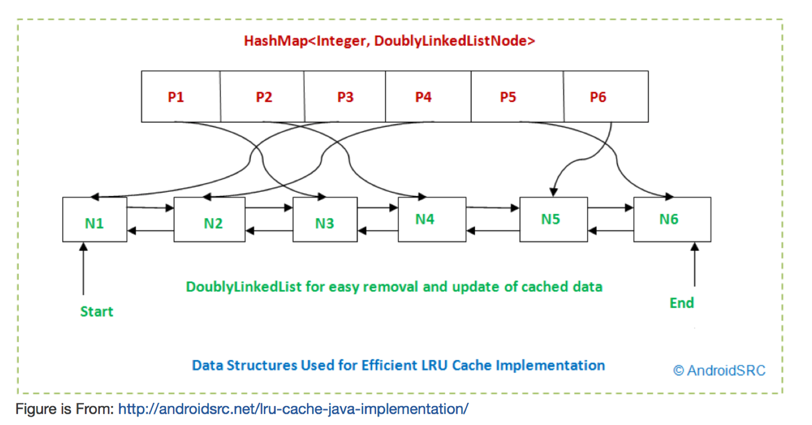

# LRU_cache (Leetcode 146)

Design and implement a data structure for Least Recently Used (LRU) cache. 
It should support the following operations: get and set.

  * get(key) – Get the value (will always be positive) of the key if the key exists in the cache, otherwise return -1.

  * set(key, value) – Set or insert the value if the key is not already present. When the cache reached its capacity, it should invalidate the least recently used item before inserting a new item.

Follow up:
Could you do both operations in O(1) time complexity?

# Analysis 

LRU cache is to keep the most recently used items in the cache and to discard the least recently used one when the cache reaches its capacity. So, items should be saved in order by "used time" in cache. 

We need to keep track of each item's used time.  When we call get(key) function, we need to update its used time to most recent besides returning it's value. When we call set(key, value) function,  we need to update its used time too.

We can use a Queue implemented by a doubled LinkedList to save the items. 
The order in the Queue representes the order of "used time". e.g., the Head indicates the most recently used item, and the tail incdicates the least recently used item. We do "remove" and "insert" to keep the order updated.  The time complexity of get(key) for a queue is O(n), and the time complextity for set(key, value) is amortized O(1).

In order to have a O(1) time for function get and set, we need an extra date strcuter: HashMap.
The HashMap key will be the function input key, the HashMap value will be the double LinkedList Node, as shown in folliwng figure.

# Date Structure

# Source code in Java and Python 

The LRU Cache Algorithm was implemented in Java and python. Please find the source code in foler /source_code/.
